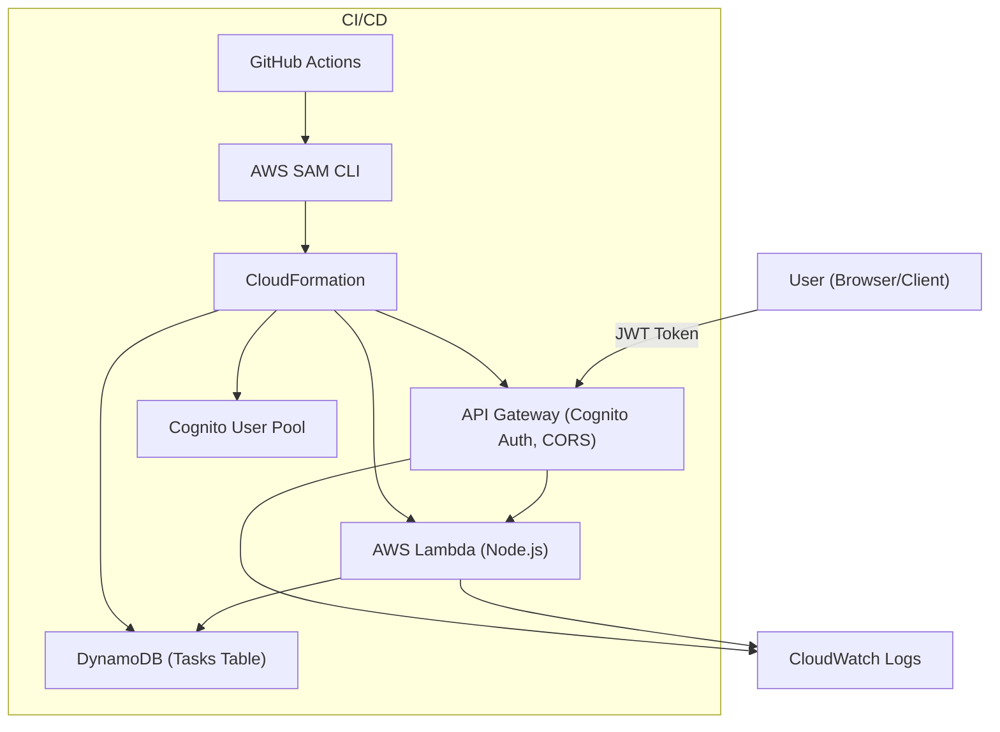

# AWS Serverless Task Manager API

A production-grade, fully serverless web application backend built on AWS. This project demonstrates best practices in cloud architecture, security, automation, and developer experience.

---

## 🚀 Overview
A scalable, secure, and cost-efficient Task Manager API using:
- **AWS Lambda** (Node.js)
- **API Gateway** (REST, Cognito Auth, CORS)
- **DynamoDB** (NoSQL, on-demand)
- **AWS SAM** (Infrastructure as Code)
- **Cognito** (User authentication)
- **CloudWatch** (Logging & monitoring)
- **GitHub Actions** (CI/CD)

---

## 🏗️ Architecture


---

## ✨ Features
- **CRUD API** for tasks (create, read, update, delete)
- **User authentication** with Cognito (JWT)
- **Per-user data isolation** (each user sees only their tasks)
- **Infrastructure as Code** (AWS SAM)
- **Automated CI/CD** with GitHub Actions
- **CloudWatch logging & X-Ray tracing**
- **CORS enabled** for frontend integration
- **Cost-optimized** DynamoDB and Lambda

---

## 🛠️ Tech Stack
- **Backend:** Node.js (Lambda)
- **API:** Amazon API Gateway (REST)
- **Database:** DynamoDB (on-demand)
- **Auth:** Amazon Cognito User Pool
- **IaC:** AWS SAM (YAML)
- **CI/CD:** GitHub Actions, AWS CodePipeline (optional)
- **Monitoring:** CloudWatch, X-Ray

---

## 🚦 Quick Start / Deployment

### Prerequisites
- AWS CLI & SAM CLI installed and configured
- Node.js 18+
- IAM user with deploy permissions

### 1. Build & Deploy
```sh
sam build
sam deploy --guided
```
- Follow prompts for stack name, region, and S3 bucket (SAM can create one for you).
- Outputs will include your API endpoint and Cognito User Pool ID.

### 2. Set Up Cognito User
- Go to AWS Console → Cognito → User Pools → Your Pool → Users and groups → Create user
- Confirm the user (via email or manually)
- Use the Hosted UI or Postman to log in and get a JWT token

### 3. Test the API
- Open `frontend/index.html` in your browser
- Enter your API URL and JWT token
- Use the form to create, list, update, and delete tasks

---

## 📝 API Reference

| Method | Endpoint         | Description         | Auth Required |
|--------|------------------|--------------------|--------------|
| GET    | /tasks           | List all tasks     | Yes          |
| POST   | /tasks           | Create a task      | Yes          |
| GET    | /tasks/{id}      | Get a task by ID   | Yes          |
| PUT    | /tasks/{id}      | Update a task      | Yes          |
| DELETE | /tasks/{id}      | Delete a task      | Yes          |

**All requests require an `Authorization: <JWT_TOKEN>` header.**

---

## 🔒 Security & Best Practices
- **IAM least privilege:** Lambda can only access its DynamoDB table
- **Cognito Auth:** All endpoints require JWT
- **No secrets in code:** Use environment variables and SSM
- **API Gateway CORS:** Allows secure frontend integration
- **CloudWatch logs:** For all Lambda/API activity
- **X-Ray tracing:** For distributed tracing

---

## 🧪 Testing
- **Unit tests:** Run with `npm test` (Jest)
- **Manual API tests:** Use the provided HTML frontend or Postman
- **CI/CD:** Automated build & deploy on push to `main` (see `.github/workflows/` or `ci/`)

---

## 📂 Project Structure
```
aws-serverless-task-manager/
├── src/
│   └── handlers/
│       └── taskHandler.js
│       └── taskHandler.test.js
├── scripts/
│   └── deploy.sh
├── frontend/
│   └── index.html
├── ci/
│   └── github-actions.yml
├── template.yaml
├── package.json
├── package-lock.json
├── README.md
└── .gitignore
```

---

## 🤝 Contributing
1. Fork this repo
2. Create a feature branch (`git checkout -b feature/your-feature`)
3. Commit your changes
4. Open a pull request

---

## 📜 License
[MIT](LICENSE)

---

## 🙋 FAQ / Troubleshooting
- **Stack stuck in ROLLBACK_COMPLETE?** Delete the stack in CloudFormation and redeploy.
- **Cognito authorizer error?** Change the logical name in the Auth block.
- **API 403/401 errors?** Make sure you’re using a valid JWT token from Cognito.
- **Need help?** Open an issue or discussion in this repo!
