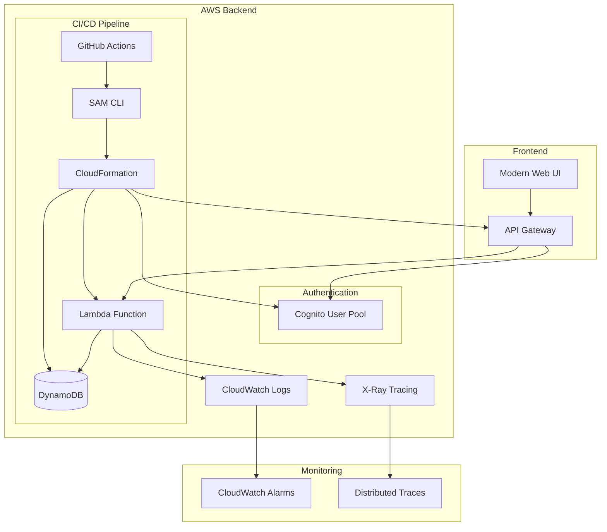

# 🚀 AWS Serverless Task Manager

A production-grade, fully serverless web application built on AWS with modern architecture, comprehensive testing, and automated CI/CD pipeline.


## 📋 Table of Contents

- Overview
- Features
- Architecture
- Tech Stack
- Quick Start
- API Documentation
- Development
- Deployment
- Monitoring
- Security
- Cost Optimization
- Acknowledgements

## 🎯 Overview

This is a complete, production-ready task management application built entirely on AWS serverless services. It demonstrates best practices in cloud architecture, security, automation, and developer experience.

### Key Highlights

- ✅ **Fully Serverless**: No servers to manage, auto-scaling, pay-per-use
- ✅ **Production Ready**: Comprehensive testing, monitoring, and security
- ✅ **Modern UI**: Responsive, professional frontend with real-time updates
- ✅ **Automated CI/CD**: GitHub Actions pipeline with staging/production environments
- ✅ **Security First**: JWT authentication, IAM least privilege, input validation
- ✅ **Cost Optimized**: DynamoDB on-demand, Lambda optimization, efficient queries

## ✨ Features

### Core Functionality
- **CRUD Operations**: Create, read, update, and delete tasks
- **User Authentication**: Secure JWT-based authentication with Amazon Cognito
- **Data Isolation**: Each user sees only their own tasks
- **Status Management**: Track task progress (pending, in-progress, completed, cancelled)
- **Real-time Updates**: Modern frontend with instant feedback

### Advanced Features
- **Input Validation**: Comprehensive data validation and sanitization
- **Error Handling**: Graceful error handling with detailed logging
- **CORS Support**: Cross-origin resource sharing for frontend integration
- **Pagination**: Efficient data loading with configurable limits
- **Filtering**: Filter tasks by status and other criteria
- **Search**: Full-text search capabilities (extensible)

### Developer Experience
- **Comprehensive Testing**: Unit tests with 80%+ coverage
- **Code Quality**: ESLint, Prettier, and automated formatting
- **Documentation**: Complete API docs and deployment guides
- **Local Development**: SAM CLI for local testing and debugging
- **Hot Reloading**: Fast development cycle with live updates

### Operations & Monitoring
- **Automated Deployment**: One-click deployment to multiple environments
- **Health Monitoring**: CloudWatch logs, metrics, and alarms
- **Performance Tracking**: X-Ray distributed tracing
- **Security Scanning**: Automated vulnerability assessment
- **Backup & Recovery**: Point-in-time recovery and disaster recovery

## 🏗️ Architecture



### Architecture Components

| Component | Service | Purpose |
|-----------|---------|---------|
| **API Layer** | API Gateway | RESTful API with authentication and CORS |
| **Compute** | Lambda | Serverless function execution |
| **Database** | DynamoDB | NoSQL database with on-demand scaling |
| **Authentication** | Cognito | User management and JWT tokens |
| **Monitoring** | CloudWatch | Logs, metrics, and alarms |
| **Tracing** | X-Ray | Distributed tracing and performance analysis |
| **Infrastructure** | CloudFormation | Infrastructure as Code |
| **CI/CD** | GitHub Actions | Automated testing and deployment |

## 🛠️ Tech Stack

### Backend
- **Runtime**: Node.js 18.x
- **Framework**: AWS Lambda
- **API**: Amazon API Gateway (REST)
- **Database**: Amazon DynamoDB (NoSQL)
- **Authentication**: Amazon Cognito User Pool
- **Infrastructure**: AWS SAM (Serverless Application Model)

### Frontend
- **Language**: HTML5, CSS3, JavaScript (ES6+)
- **Styling**: Modern CSS with gradients and animations
- **Icons**: Font Awesome
- **Responsive**: Mobile-first design

### DevOps & Tools
- **CI/CD**: GitHub Actions
- **Testing**: Jest (Unit tests)
- **Linting**: ESLint + Prettier
- **Security**: Snyk vulnerability scanning
- **Monitoring**: CloudWatch + X-Ray

## 🚀 Quick Start

### Prerequisites

1. **AWS Account** with appropriate permissions
2. **Node.js** 18.x or later
3. **AWS CLI** configured with credentials
4. **AWS SAM CLI** installed

### One-Command Deployment

```bash
# Clone the repository
git clone https://github.com/yourusername/aws-serverless-task-manager.git
cd aws-serverless-task-manager

# Install dependencies
npm ci

# Deploy to AWS (interactive)
npm run deploy

# Or use the automated script
chmod +x scripts/deploy.sh
./scripts/deploy.sh
```

### Manual Deployment

```bash
# 1. Build the application
npm run build

# 2. Deploy to AWS
sam deploy --guided

# 3. Get deployment outputs
aws cloudformation describe-stacks \
  --stack-name task-manager-api \
  --query "Stacks[0].Outputs" \
  --output table
```

### Post-Deployment Setup

1. **Create a test user**:
```bash
# Get User Pool ID from stack outputs
USER_POOL_ID=$(aws cloudformation describe-stacks \
  --stack-name task-manager-api \
  --query "Stacks[0].Outputs[?OutputKey=='CognitoUserPoolId'].OutputValue" \
  --output text)

# Create test user
aws cognito-idp admin-create-user \
  --user-pool-id $USER_POOL_ID \
  --username testuser \
  --temporary-password "TempPass123!" \
  --user-attributes Name=email,Value="test@example.com" Name=email_verified,Value=true
```

2. **Open the frontend**: Open `frontend/index.html` in your browser
3. **Enter credentials**: Use the API URL and JWT token from the deployment
4. **Start managing tasks**: Create, update, and delete tasks

## 📚 API Documentation

Complete API documentation is available in [`docs/API.md`](docs/API.md).

### Quick API Reference

| Method | Endpoint | Description | Auth Required |
|--------|----------|-------------|---------------|
| `GET` | `/tasks` | List all tasks | ✅ |
| `POST` | `/tasks` | Create a new task | ✅ |
| `GET` | `/tasks/{id}` | Get a specific task | ✅ |
| `PUT` | `/tasks/{id}` | Update a task | ✅ |
| `DELETE` | `/tasks/{id}` | Delete a task | ✅ |

### Example Usage

```bash
# List tasks
curl -H "Authorization: <JWT_TOKEN>" \
  https://your-api.execute-api.region.amazonaws.com/prod/tasks

# Create a task
curl -X POST \
  -H "Authorization: <JWT_TOKEN>" \
  -H "Content-Type: application/json" \
  -d '{"title": "New Task", "status": "pending"}' \
  https://your-api.execute-api.region.amazonaws.com/prod/tasks
```

## 🛠️ Development

### Local Development

```bash
# Install dependencies
npm ci

# Run tests
npm test

# Run tests with coverage
npm run test:coverage

# Lint code
npm run lint

# Format code
npm run format

# Start local API
npm run local:start
```

### Project Structure

```
aws-serverless-task-manager/
├── src/
│   └── handlers/
│       ├── taskHandler.js          # Main Lambda function
│       └── taskHandler.test.js     # Unit tests
├── frontend/
│   └── index.html                  # Modern web interface
├── docs/
│   ├── API.md                      # API documentation
│   └── DEPLOYMENT.md               # Deployment guide
├── ci/
│   └── github-actions.yml          # CI/CD pipeline
├── scripts/
│   └── deploy.sh                   # Deployment script
├── template.yaml                   # SAM template
├── package.json                    # Dependencies and scripts
└── README.md                       # This file
```

### Testing

```bash
# Run all tests
npm test

# Run tests in watch mode
npm run test:watch

# Run tests with coverage
npm run test:coverage

# Run security audit
npm run security:audit
```

## 🚀 Deployment

### Automated Deployment

The application includes a comprehensive CI/CD pipeline that automatically:

1. **Tests**: Runs unit tests and security scans
2. **Builds**: Validates and builds the SAM application
3. **Deploys**: Deploys to staging (develop branch) or production (main branch)
4. **Monitors**: Sets up monitoring and alerting

### Environment Configuration

| Environment | Branch | Stack Name | Purpose |
|-------------|--------|------------|---------|
| **Development** | `develop` | `task-manager-api-dev` | Feature testing |
| **Staging** | `develop` | `task-manager-api-staging` | Pre-production testing |
| **Production** | `main` | `task-manager-api` | Live application |

### Manual Deployment Options

```bash
# Development environment
npm run deploy:dev

# Staging environment
npm run deploy:staging

# Production environment
npm run deploy:prod

# Custom deployment
./scripts/deploy.sh my-stack us-west-2 production
```


## 📊 Monitoring

### CloudWatch Monitoring

The application includes comprehensive monitoring:

- **Lambda Metrics**: Duration, errors, throttles
- **API Gateway**: Request count, latency, 4xx/5xx errors
- **DynamoDB**: Read/write capacity, throttled requests
- **Custom Metrics**: Business metrics and KPIs

### Logging

```bash
# View Lambda logs
sam logs -n TaskApiFunction --stack-name task-manager-api

# View API Gateway logs
aws logs describe-log-groups --log-group-name-prefix "/aws/apigateway"
```

### Alerts

The application automatically sets up CloudWatch alarms for:
- High error rates
- High latency
- DynamoDB throttling
- Lambda function errors

## 🔒 Security

### Security Features

- **Authentication**: JWT tokens via Amazon Cognito
- **Authorization**: User-level data isolation
- **Input Validation**: Comprehensive data validation
- **CORS**: Proper cross-origin resource sharing
- **IAM**: Least privilege access policies
- **Encryption**: Data encrypted at rest and in transit

### Security Best Practices

1. **Regular Updates**: Keep dependencies updated
2. **Security Scanning**: Automated vulnerability assessment
3. **Access Control**: Principle of least privilege
4. **Monitoring**: Real-time security monitoring
5. **Backup**: Regular data backups and recovery testing

## 💰 Cost Optimization

### Cost-Effective Design

- **Pay-per-use**: Only pay for actual usage
- **Auto-scaling**: Automatically scales with demand
- **DynamoDB On-demand**: No capacity planning required
- **Lambda optimization**: Efficient memory and timeout settings

### Estimated Costs

| Service | Monthly Cost (1000 users) |
|---------|---------------------------|
| Lambda | ~$5-10 |
| DynamoDB | ~$10-20 |
| API Gateway | ~$5-10 |
| Cognito | ~$1-5 |
| **Total** | **~$20-45** |

*Costs vary based on usage patterns and region*


### Code Standards

- Follow the existing code style
- Add tests for new features
- Update documentation as needed
- Ensure all tests pass
- Run linting before committing


## 🙏 Acknowledgments

- **AWS SAM** for the excellent serverless framework
- **Jest** for comprehensive testing capabilities
- **Font Awesome** for beautiful icons
- **GitHub Actions** for seamless CI/CD
